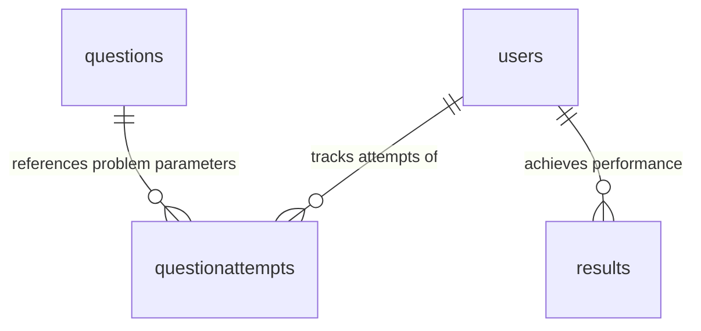
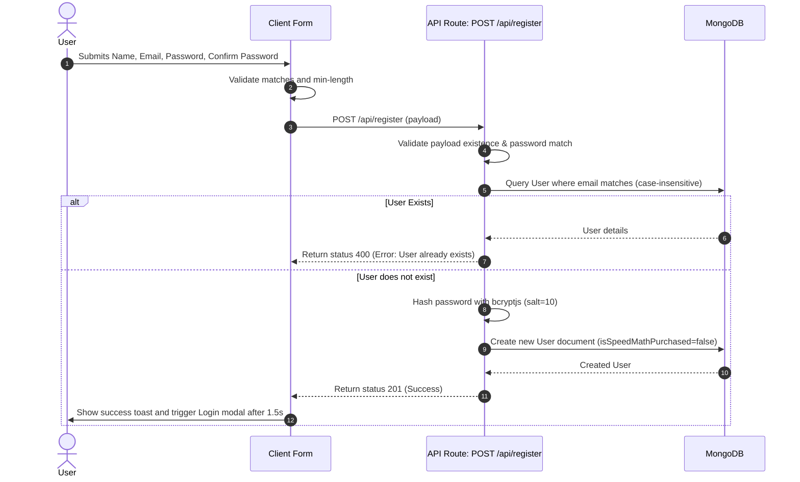
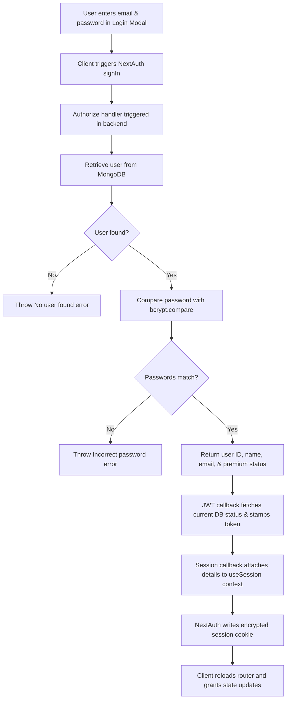
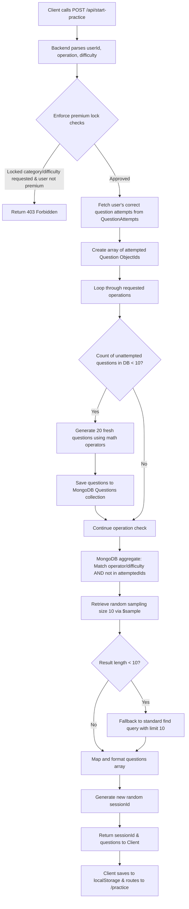
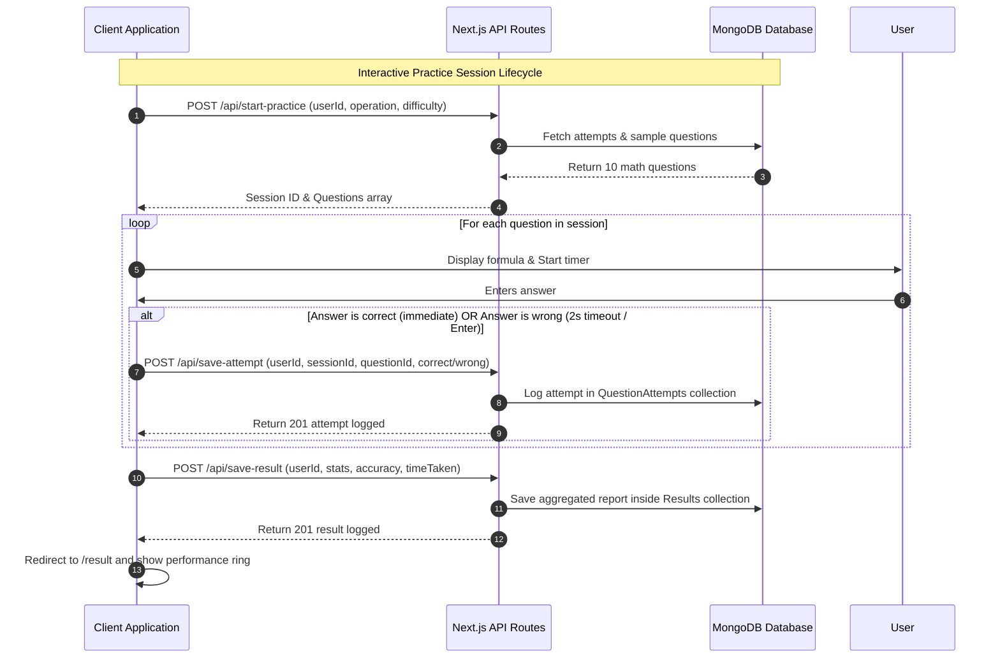

# ⚡ Speed Math 


Technology Stack • Next.js • TypeScript (TSX) • Bootstrap • Inline CSS (existing project pattern) • NextAuth Authentication • MongoDB • Fully Responsive UI (Mobile, Tablet, Desktop)

Question Categories Provide 4 categories:

Addition Subtraction Multiplication Division Difficulty Levels Easy, Medium, Hard

Purchase Based Access Control Purchased Users Users who have purchased the Speed Math course/package can:

✅ Access all question categories

• Addition • Subtraction • Multiplication • Division

✅ Change difficulty level

• Easy • Medium • Hard

Non-Purchased Users Users who have NOT purchased the Speed Math course/package can:

✅ Access only:

• Addition • Subtraction

❌ Multiplication locked

❌ Division locked

❌ Cannot change difficulty level

• Default difficulty = Easy

Question Attempt Logic Important Rule Once a user attempts a question:

• That question should never be shown again to the same user. • Applicable across all sessions. • Persist in database.


---

## 📋 Table of Contents

1. [Project Overview](#1-project-overview)
2. [Features](#2-features)
3. [How Authentication Works](#3-how-authentication-works)
4. [Registration Flow](#4-registration-flow)
5. [Login Flow](#5-login-flow)
6. [How Questions Are Generated](#6-how-questions-are-generated)
7. [Project Architecture](#7-project-architecture)
8. [Database Design](#8-database-design)
9. [API Documentation](#9-api-documentation)
10. [Technologies Used](#10-technologies-used)
11. [Installation Guide](#11-installation-guide)
12. [Environment Variables](#12-environment-variables)
13. [Skills Demonstrated](#15-skills-demonstrated)
14. [Flow Diagrams](#17-flow-diagrams)
15. [Code Quality](#18-code-quality)

---

## 1. Project Overview

### What this project is
**Speed Math** is a high-performance web platform built on Next.js 16 (App Router) and React 19, allowing users to configure mathematical drills using arithmetic operators (Addition, Subtraction, Multiplication, Division) and multiple difficulty tiers (Easy, Medium, Hard).

### Why it was built
Competitive exams such as the **CAT (Common Admission Test)** evaluate candidates on both quantitative comprehension and speed. Slow manual calculations can form a significant bottleneck, causing candidates to leave questions unattempted. Speed Math was developed to replace slow, manual worksheet drills with an adaptive digital tool that guarantees users always practice with fresh, non-repetitive equations.

### What problem it solves
* **Calculation Sluggishness:** Provides a distraction-free, stopwatch-tracked practice screen that enforces rapid responses.
* **Repetitive Learning:** Tracks every correct answer to ensure the same math problem is never served to the user twice.
* **Lack of Insights:** Aggregates overall speed, correctness, and accuracy percentages to deliver quantitative feedback.

---

## 2. Features

* **User Registration:** Secure register layout collecting Name, Email, Password, and Confirm Password with client-side and server-side validation.
* **User Login:** Multiple authentication entry points supporting custom credentials (email/password) and OAuth integration (Google Provider).
* **Robust Authentication:** Session management via JWT strategy using NextAuth.js.
* **Strict Authorization Gates:** 
  * *Guests:* Limited to Addition and Subtraction categories under Easy difficulty. Multiplication, Division, Medium, and Hard selections are locked. Attempting to click locks triggers the **Login Modal**.
  * *Free Tier Users:* Access is restricted to Easy Addition and Subtraction. Interacting with locked modules triggers the **Premium Required Modal**.
  * *Premium Tier Users:* Full unrestricted access to all operations and difficulties.
* **JWT / Session Flow:** NextAuth callbacks check database state on token refresh, immediately applying upgrades (such as course enrollment) to active React contexts.
* **Protected Routes:** Next.js route protection on `/practice` and `/result` pages to redirect unauthenticated requests back to the landing page.
* **Dynamic Question Generation:** Algorithmic operand boundaries scaling dynamically with selected difficulties (Easy, Medium, Hard).
* **Automatic Question Solving Flow:** Auto-submits answers immediately when they are correct to optimize user engagement speed.
* **Debounced Error Validation:** Highlights input borders red when incorrect. Employs a 2-second debounce timer before registering wrong attempts to allow users a moment to correct typos.
* **Granular Score Calculation:** Accuracy is calculated on first-try correct responses, preventing users from inflating scores by brute-forcing answers.
* **Personalized Practice History:** Tracks historical attempts and aggregates report cards on session completion.
* **Practice Session Timer:** Stopwatch tracks elapsed duration in real-time.
* **Focused Mode Switch:** Toggles the header, footer, and sidebar off to minimize distractions.
* **Adaptive Custom Numeric Keypad:** Mobile-friendly keypad centered below the answer box.
* **Premium SVG Performance Ring:** Beautiful SVG circle progress bar dynamically colored based on performance thresholds:
  * 🟢 **Green:** Accuracy $\ge$ 80% (Excellent)
  * 🟡 **Amber:** Accuracy $\ge$ 50% (Moderate)
  * 🔴 **Red:** Accuracy $<$ 50% (Requires Improvement)

---

## 3. How Authentication Works

Speed Math uses a custom NextAuth.js structure integrating both a local Credentials Provider and external OAuth providers.

```
[ User Registration ]
         ↓
[ Password Hashing (bcryptjs, salt=10) ]
         ↓
[ Persist User in MongoDB (isSpeedMathPurchased = false) ]
         ↓
[ User Credentials Submit (Login Form) ]
         ↓
[ Query Email & Match Password via bcrypt.compare() ]
         ↓
[ NextAuth JWT Generation (Binds User ID & isSpeedMathPurchased) ]
         ↓
[ Encrypted Session Token Saved in HTTP-Only Cookie ]
         ↓
[ React Context Binds useSession() Hooks to UI Components ]
         ↓
[ Protected Page Routing Checked via Session Middleware ]
```

---

## 4. Registration Flow

1. **User Submits Details:** Form inputs capture `name`, `email`, `password`, and `confirmPassword`.
2. **Input Validation:**
   * Checks if all fields are non-empty.
   * Compares `password` and `confirmPassword` for equality.
   * Enforces a minimum password length of **6 characters**.
3. **Duplicate Email Verification:** Queries MongoDB using lowercase formatting. If email matches an existing user, returns a `400 Bad Request` payload: `User already exists with this email`.
4. **Hashing Credentials:** Password undergoes hashing via `bcryptjs` with `10` salt rounds.
5. **Database Storage:** Persists user details to the MongoDB `users` collection with the default `isSpeedMathPurchased: false` flag.
6. **Success Sequence:** Returns a `201 Created` status with the user profile ObjectID. Client displays success notification and automatically redirects to the Login view after 1.5 seconds.

---

## 5. Login Flow

1. **Credentials Dispatch:** Email and password are submitted via the Login Modal.
2. **Identity Verification:** The `authorize` handler inside NextAuth connects to MongoDB, locates the user document via email, and compares the password hash.
3. **JWT Creation & Enhancement:** NextAuth creates a JWT payload. The `jwt` callback pulls the latest details from MongoDB to assign active premium permissions:
   ```typescript
   token.isSpeedMathPurchased = dbUser.isSpeedMathPurchased;
   ```
4. **Session Cookie Storage:** NextAuth encryptes the session payload and stores it in secure client cookies.
5. **UI Update:** Triggers client-side context synchronization (`router.refresh()`), updates the local navigation header, and dismisses the login overlay.
6. **Logout:** The user triggers NextAuth `signOut({ callbackUrl: "/" })`, which clears the session cookie and routes back to the landing page.

---

## 6. How Questions Are Generated

This project uses a hybrid question supply chain to manage storage and database load.

### Question Supply Chain Flow

```
[ Practice Starts: POST /api/start-practice ]
                      ↓
[ Fetch User's Successfully Solved Attempts: QuestionAttempt.distinct('questionId') ]
                      ↓
[ Filter Out Answered ID Set: { _id: { $nin: attemptedIds } } ]
                      ↓
[ Verify Database Supply: Count Unattempted Questions in MongoDB ]
                      ↓
           { Count < 10 for Selected Operations? }
                     /       \
             Yes (Low)       No (Adequate)
                   /           \
[ Generate 20 New Math Problems ]  [ Skip Generation ]
                   \           /
                      ↓
[ MongoDB Aggregation: $match Category/Difficulty & $sample: 10 ]
                      ↓
            { Result Count >= 10? }
                     /       \
                Yes           No (Fallback)
                 /             \
       [ Map Data ]       [ standard MongoDB find().limit(10) ]
                 \             /
                      ↓
[ Generate Session ID & Return 10 Math Questions to Client ]
```

### Algorithmic Difficulty Formula Details

#### 1. Addition (`+`)
* **Easy:** Operands generated between `10` and `99`.
* **Medium:** Operands generated between `100` and `999`.
* **Hard:** Operands generated between `1000` and `9999`.

#### 2. Subtraction (`-`)
* **Operand Ordering:** To prevent negative results, operands are always evaluated as:
  $$\text{operand1} = \max(\text{num1}, \text{num2})$$
  $$\text{operand2} = \min(\text{num1}, \text{num2})$$
* **Easy:** Operands between `10` and `99`.
* **Medium:** Operands between `100` and `999`.
* **Hard:** Operands between `1000` and `9999`.

#### 3. Multiplication (`x`)
* **Easy:** Both operands generated between `2` and `12`.
* **Medium:** Operand 1 between `10` and `99`; Operand 2 between `2` and `9`.
* **Hard:** Operand 1 between `100` and `999`; Operand 2 between `10` and `99`.

#### 4. Division (`/`)
* **Clean Quotients:** To ensure divisions result in clean integer calculations, division components are generated backwards:
  1. Generate `divisor` and `result` (quotient).
  2. Set:
     $$\text{operand1} = \text{divisor} \times \text{result}$$
     $$\text{operand2} = \text{divisor}$$
     $$\text{answer} = \text{result}$$
* **Easy:** Divisor between `2` and `12`; Quotient between `2` and `12`.
* **Medium:** Divisor between `2` and `20`; Quotient between `10` and `50`.
* **Hard:** Divisor between `10` and `50`; Quotient between `20` and `150`.

---

## 7. Project Architecture

The codebase separates API concerns from client UI views:

```
speed-math/
├── scripts/                  # Command line automation utilities
│   └── seedQuestions.ts      # Seeding script to initialize the MongoDB question pool
├── src/
│   ├── app/                  # Next.js App Router root layout and path handlers
│   │   ├── api/              # Serverless API routes
│   │   │   ├── auth/         # NextAuth.js authentication router
│   │   │   ├── purchase/     # Mock billing payment update endpoint
│   │   │   ├── register/     # User profile registration handler
│   │   │   ├── save-attempt/ # Real-time response attempt logger
│   │   │   ├── save-result/  # Session results aggregation reporting endpoint
│   │   │   └── start-practice/# Practice session initiator & question allocator
│   │   ├── practice/         # Practice component page showing questions and keypad
│   │   ├── result/           # Report card showing SVG accuracy charts
│   │   ├── layout.tsx        # Top-level providers wrapper
│   │   └── page.tsx          # Speed Math landing dashboard layout
│   ├── components/           # Reusable UI component elements
│   │   ├── AuthModals.tsx    # Sign-up, Sign-in, and Premium paywall modals
│   │   ├── ContentSection.tsx# Informative block detailing benefits of Speed Math
│   │   ├── HeroSection.tsx   # Top banner showcasing total active metrics
│   │   ├── HowItWorks.tsx    # 3-step onboarding timeline guide
│   │   ├── ModalContext.tsx  # React Context controlling global modal visibility
│   │   ├── Navbar.tsx        # Responsive navigation and session layout controls
│   │   ├── OfferSection.tsx  # Complete premium pricing module and checkout trigger
│   │   ├── SessionProviderWrapper.tsx # NextAuth provider integration wrapper
│   │   └── StickyPracticeBox.tsx # Interactive sidebar panel for practice setup
│   ├── lib/                  # Backend utilities & server configurations
│   │   ├── auth.ts           # NextAuth Credentials provider specifications
│   │   └── mongodb.ts        # Database connection pool manager with caching
│   ├── models/               # Mongoose schemas mapping MongoDB collections
│   │   ├── Question.ts       # Mathematical equations storage model
│   │   ├── QuestionAttempt.ts# Individual question performance metrics
│   │   ├── Result.ts         # Final aggregate practice performance summary
│   │   └── User.ts           # Hashed credentials profile and permissions metadata
│   └── types/                # TypeScript interface declaration extensions
│       └── next-auth.d.ts    # NextAuth user type extensions for custom attributes
```

---

## 8. Database Design

Speed Math uses MongoDB managed via Mongoose models. In serverless environments, database connection pooling is cached globally to avoid exhausting resource limits.

### Collections & Models



#### 1. `User` Schema
Tracks authentication credentials, user profiles, and subscription details.

| Field Name | Type | Constraints / Attributes | Description |
| :--- | :--- | :--- | :--- |
| `name` | `String` | Required | Full Name of the User |
| `email` | `String` | Unique, lowercase, trim, Required | Email address (login username) |
| `password` | `String` | Required | Cryptographically secure Bcrypt hash |
| `isSpeedMathPurchased`| `Boolean` | Default: `false` | Access control flag for Premium tier |
| `createdAt` / `updatedAt`| `Date` | Mongoose Timestamps | Record creation and change metadata |

#### 2. `Question` Schema
Contains the generated math questions.

| Field Name | Type | Constraints / Attributes | Description |
| :--- | :--- | :--- | :--- |
| `operand1` | `Number` | Required | Left value of mathematical equation |
| `operand2` | `Number` | Required | Right value of mathematical equation |
| `operator` | `String` | Required | Math sign: `+`, `-`, `x`, `/` |
| `answer` | `Number` | Required | Solved integer result |
| `operation` | `String` | Indexed, Required | Operation type classification |
| `difficulty` | `String` | Indexed, Required | Difficulty tier: `easy`, `medium`, `hard` |
| `createdAt` / `updatedAt`| `Date` | Mongoose Timestamps | Record creation and change metadata |

#### 3. `QuestionAttempt` Schema
Logs individual attempts during a practice session.

| Field Name | Type | Constraints / Attributes | Description |
| :--- | :--- | :--- | :--- |
| `userId` | `ObjectId` | Indexed, Ref: `User`, Required | Reference to the attempting user |
| `sessionId` | `String` | Indexed, Required | Unique ID of the practice session |
| `questionId` | `ObjectId` | Ref: `Question`, Required | Reference to the exact math equation |
| `operation` | `String` | Required | Attempted category |
| `difficulty` | `String` | Required | Attempted difficulty tier |
| `isCorrect` | `Boolean` | Required | Marks if the response matches `answer` |
| `createdAt` / `updatedAt`| `Date` | Mongoose Timestamps | Record creation and change metadata |

#### 4. `Result` Schema
Stores final aggregated summaries of completed practice sessions.

| Field Name | Type | Constraints / Attributes | Description |
| :--- | :--- | :--- | :--- |
| `userId` | `ObjectId` | Indexed, Ref: `User`, Required | Reference to the practice user |
| `operation` | `String` | Required | Practiced operations (comma-separated list) |
| `difficulty` | `String` | Required | Practiced difficulty tier |
| `totalQuestions`| `Number` | Default: `10`, Required | Total questions in practice session |
| `correctAnswers`| `Number` | Required | Count of questions solved correctly on first try |
| `incorrectAnswers`| `Number` | Required | Count of incorrect attempts |
| `accuracyPercentage`| `Number` | Required | Calculated correct answer ratio |
| `timeTaken` | `Number` | Required | Session duration in seconds |
| `createdAt` / `updatedAt`| `Date` | Mongoose Timestamps | Record creation and change metadata |

---

## 9. API Documentation

All endpoints receive and return JSON payloads. Protected endpoints verify the caller's session via NextAuth.

### 1. User Registration
* **Endpoint:** `POST /api/register`
* **Auth Required:** No
* **Request Body:**
  ```json
  {
    "name": "John Doe",
    "email": "johndoe@example.com",
    "password": "SecurePassword123",
    "confirmPassword": "SecurePassword123"
  }
  ```
* **Response:**
  * `201 Created`
    ```json
    {
      "message": "User registered successfully",
      "userId": "60d5ec4934d40214a0e2d312"
    }
    ```
  * `400 Bad Request`
    ```json
    { "error": "Passwords do not match" }
    ```

### 2. Mock Payment Processing
* **Endpoint:** `POST /api/purchase`
* **Auth Required:** No (Mock payment simulator)
* **Request Body:**
  ```json
  {
    "userId": "60d5ec4934d40214a0e2d312"
  }
  ```
* **Response:**
  * `200 OK`
    ```json
    {
      "message": "Simulated payment successful! Speed Math package upgraded.",
      "isSpeedMathPurchased": true
    }
    ```
  * `404 Not Found`
    ```json
    { "error": "User not found" }
    ```

### 3. Start Practice Session
* **Endpoint:** `POST /api/start-practice`
* **Auth Required:** Yes
* **Request Body:**
  ```json
  {
    "userId": "60d5ec4934d40214a0e2d312",
    "operation": "addition,subtraction",
    "difficulty": "easy"
  }
  ```
* **Response:**
  * `200 OK`
    ```json
    {
      "sessionId": "60d5ec8b34d40214a0e2d354",
      "questions": [
        {
          "id": "60d5ec8b34d40214a0e2d3aa",
          "operand1": 42,
          "operand2": 19,
          "operator": "+",
          "answer": 61,
          "operation": "addition",
          "difficulty": "easy"
        }
      ]
    }
    ```
  * `403 Forbidden` (Paywall Gate)
    ```json
    { "error": "Multiplication and Division are locked for non-premium users." }
    ```

### 4. Save Question Attempt
* **Endpoint:** `POST /api/save-attempt`
* **Auth Required:** Yes
* **Request Body:**
  ```json
  {
    "userId": "60d5ec4934d40214a0e2d312",
    "sessionId": "60d5ec8b34d40214a0e2d354",
    "questionId": "60d5ec8b34d40214a0e2d3aa",
    "operation": "addition",
    "difficulty": "easy",
    "isCorrect": true
  }
  ```
* **Response:**
  * `201 Created`
    ```json
    {
      "message": "Attempt saved successfully",
      "attemptId": "60d5eca234d40214a0e2d3bc"
    }
    ```

### 5. Save Final Practice Results
* **Endpoint:** `POST /api/save-result`
* **Auth Required:** Yes
* **Request Body:**
  ```json
  {
    "userId": "60d5ec4934d40214a0e2d312",
    "operation": "addition,subtraction",
    "difficulty": "easy",
    "totalQuestions": 10,
    "correctAnswers": 8,
    "incorrectAnswers": 2,
    "accuracyPercentage": 80,
    "timeTaken": 45
  }
  ```
* **Response:**
  * `201 Created`
    ```json
    {
      "message": "Result saved successfully",
      "resultId": "60d5ecb534d40214a0e2d3cc"
    }
    ```

---

## 10. Technologies Used

* **Next.js (v16.2.9 - App Router):** Framework selected for routing structure, serverless API capability, and deployment speed.
* **React (v19.2.4):** Dynamic render state, hook structures (e.g. `useRef`, `useState`, `useEffect`), and real-time typing events.
* **TypeScript:** Ensures static typing safety across API models, utility functions, and props contracts.
* **MongoDB & Mongoose (v9.7.2):** Scalable document database paired with an ODM (Object Document Mapper) that defines schemas and maps data schemas directly.
* **NextAuth.js (v4.24.14):** Handles authentication using local credentials and third-party login providers.
* **Bootstrap (v5.3.8):** A styling framework that ensures responsiveness on mobile devices, tablets, and desktops using the grid system.
* **Bcryptjs (v3.0.3):** Hashes user passwords securely in MongoDB to protect credentials.
* **React Icons (v5.6.0):** Provides clean UI symbols for operations, clocks, and locks.

---

## 11. Installation Guide

### Prerequisites
* [Node.js](https://nodejs.org/) (v18.x or later)
* [MongoDB](https://www.mongodb.com/) (Local server instance or MongoDB Atlas Cloud Cluster)

### Step 1: Clone the Repository
```bash
git clone https://github.com/yourusername/speed-math.git
cd speed-math/speed-math
```

### Step 2: Install Project Dependencies
```bash
npm install
```

### Step 3: Configure Environment Variables
Create a file named `.env.local` in the root of the `speed-math/` subdirectory and configure the following variables:
```env
NEXTAUTH_URL=http://localhost:3000
NEXTAUTH_SECRET=your_32_character_cryptographically_secure_nextauth_secret
MONGODB_URI=mongodb+srv://<username>:<password>@cluster0.mongodb.net/speedmath?retryWrites=true&w=majority
```

### Step 4: Seed Initial Practice Questions (Optional)
Run the script to populate the database with an initial pool of questions:
```bash
npx ts-node --project tsconfig.json scripts/seedQuestions.ts
```

### Step 5: Run the Development Server
```bash
npm run dev
```
Open [http://localhost:3000](http://localhost:3000) in your browser to view the application.

### Step 6: Build and Run Production Bundle
```bash
npm run build
npm start
```

---

## 12. Environment Variables

| Variable Name | Required | Default Value | Description |
| :--- | :--- | :--- | :--- |
| `MONGODB_URI` | **Yes** | *None* | Connection URL for your MongoDB database. |
| `NEXTAUTH_SECRET` | **Yes** | *None* | Key used to encrypt tokens and session cookies. |
| `NEXTAUTH_URL` | **Yes** | `http://localhost:3000` | Canonical URL of your web application deployment. |

---

## 13. Skills Demonstrated

* **Secure Authentication:** Implements NextAuth credentials flow with password hashing using bcrypt.
* **Strict Authorization Gates:** Restricts premium operations and difficulties on both front-end options and API entry points.
* **Mongoose Schema Design:** Schema modeling with index attributes (`userId`, `sessionId`, `operation`) to optimize query performance.
* **Algorithmic Math Question Generation:** Custom random value generators adapted to arithmetic operators and difficulties.
* **Responsive UI Design:** A fluid layout built with Bootstrap grid selectors and custom CSS animations.
* **Event Handlers & Validation:** Input validation with debounce timers to manage client inputs.

---


## 14. Flow Diagrams

### 1. User Registration Flow


### 2. User Login Flow


### 3. Dynamic Question Allocation Flow


### 4. Interactive Quiz Request Loop Flow


---

## 15. Code Quality

### Clean Architecture
* **Separation of Concerns:** Business logic (such as mathematical calculations and difficulty boundaries) is isolated inside backend API routes. Front-end screens focus on capturing events and handling inputs.
* **Component Reusability:** Overlays, navigation, practice panels, and timelines are modularized into independent components under the `components/` directory.
* **Data Consistency:** Interfaces and TypeScript contracts are exported cleanly to prevent run-time type mismatch bugs.
* **MongoDB Index Optimization:** High-frequency query selectors (`userId`, `sessionId`, `operation`, `difficulty`) use database indices to sustain fast document lookups as storage scales.
